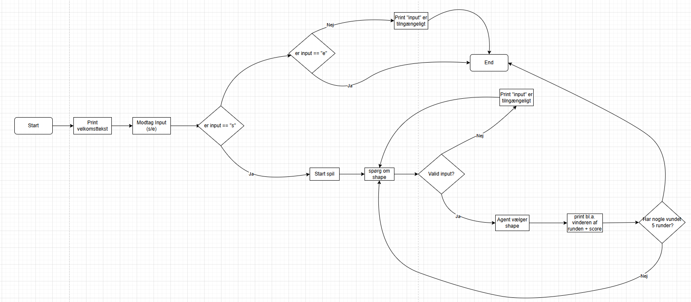

# Rock Paper Scissors Lizard Spock  

This repository contains my (s244871) code for the (62712) Rock Paper Scissors Lizard Spock assignment.  
The program allows a single player to play Rock Paper Scissors Lizard Spock against an agent. The agent chooses randomly, and the program tracks scores until one player reaches the winning score. Invalid inputs are dealt with.

Below is the flowchart showing the program's process:

## Files
- [RPSSL.c](RPSSL.c) – main program code  
- [RPSSL_flowchart.png](RPSSL_flowchart.png) – flowchart of the program
